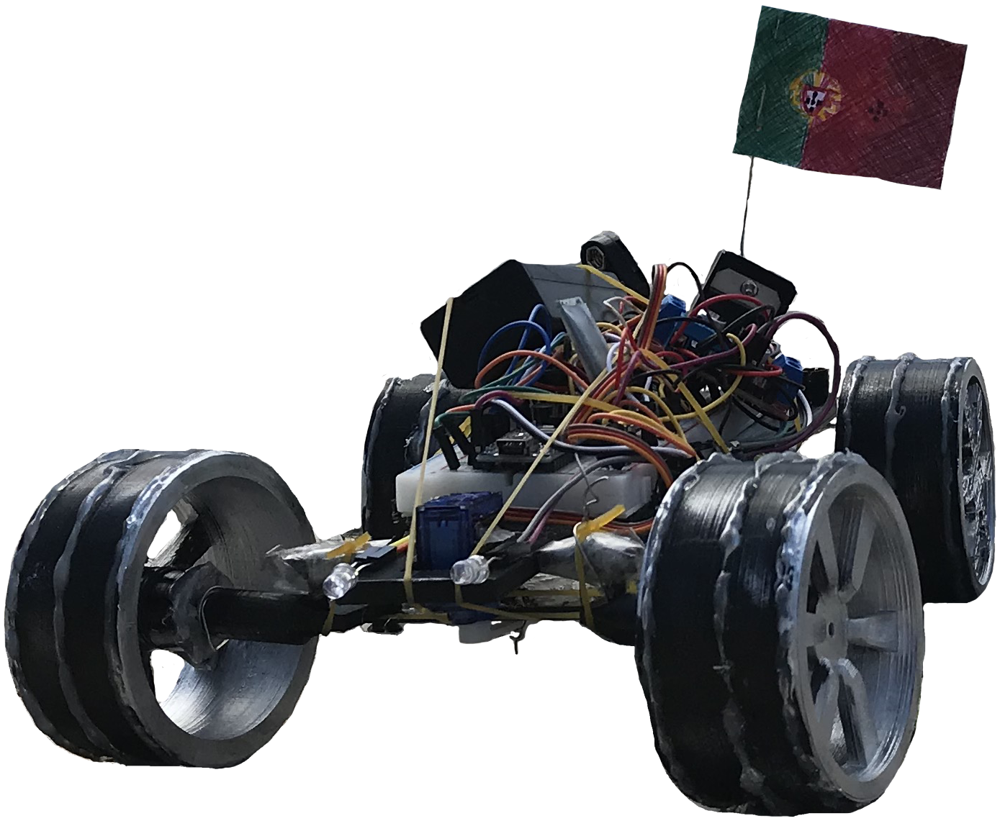
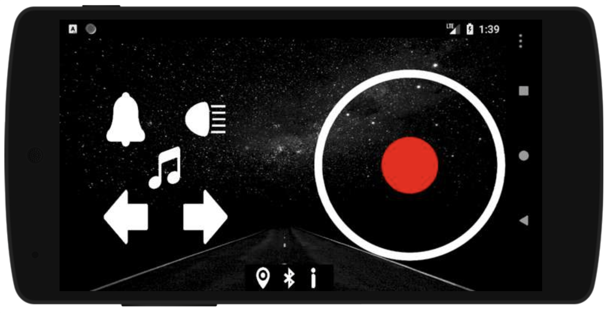

# RCar

A remote controlled car and the respective app were developed under the supervision of Prof. Luís Sousa, from Instituto Superior Técnico (University of Lisbon). 

## Car

All parts of the RC car were modelled using the CAD software SolidWorks. The complete model was divided in several components (which were meant to be 3D printed separately): wheels, chassis, L-shape axles, connecting bar and the body of the car.

## App

Using MIT App Inventor 2, we developed an Android app that is able to control many features of a RC car, using a Bluetooth connection. Specifically, the angular velocity of the back wheels, the rotation angle of a front servo, a horn, music, light and GPS components.

